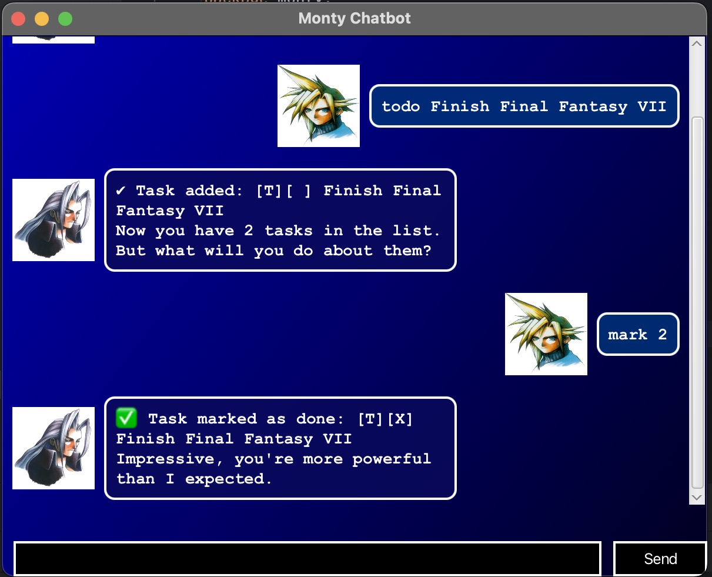

# Monty User Guide
> *"Don't deny me. Whoops, I meant to say 'Hi, there!'"*

## Overview


Have you struggled with keeping track of everything going on in your life? Wouldn't it be nice to have a task manager that could help you sort all of that out?

Meet **Monty**, the list-obsessed, task-managing chatbot, designed to handle your day-to-day task management.  

Monty takes in **text-commands** that allow you to create, manage, and sort tasks efficiently.  

It's strange, though. I wonder why Monty is behaving so oddly...  
Oh well, it must be a coincidence!

---

## Features

### 📌 Adding Tasks
Monty allows you to add different types of tasks to your list. Suppose you want to add a task reminding you to buy milk from the grocery store.
Once you've successfully it to your list, you should see the message:
```
 Got it. I've added this task:
   [T][ ] Buy milk
  Now you have 3 tasks in the list. But what will you do about them?
```
There are three main types of task, all of which will be outlined below.
#### **1. To-Do Tasks**
Use this command to add a simple to-do task.

**Example:**

```
todo Wash the dishes
```

This will be added to the list as a **'todo'** task.
#### **2. Deadlines**
Use this command to add a task with a deadline which includes a date and time in the format:
YYYY-MM-dd HHmm

**Example:**  
```
deadline Return borrowed books to library /by 2025-03-03 2359
```

This will be added to the list as a **'deadline'** task.


#### **3. Events**
Add an event with a start and end time, with dates and times in the format:
YYYY-MM-dd HHmm

**Example:**
```
event Birthday party /from 2025-03-15 1800 /to 2025-03-15 2300
```

---

### 📜 Listing Tasks
View all tasks stored in Monty. With the simple command:

```
list
```
Monty will list out all the tasks you've added to your list so far. It even saves a record of your current list for the next time you open the app!

```
📋 Here are the tasks in your list:

    1. [T][ ] Wash the dishes
    2. [D][ ] Return borrowed books to library (by: Mar 03 2025, 11:59 PM)
    3. [E][ ] Birthday party (from: Mar 15 2025, 6:00 PM to 11:00 PM)
```


---

### ✅🔄 Marking and unmarking tasks

To keep track of your progress, you can mark a task as done or undo it by using the task's index number according to the list. 
You can mark or unmark a task as done regardless of what it is currently marked as. So please keep this in mind!

#### Marking a task as done
```
mark 1
```

And what you'll see is:
```
✅ Task marked as done: [T][X] Wash the dishes
Impressive, you're more powerful than I expected.
```


#### Unmarking a task
```
unmark 1
```
Similarly, you should see: 
```
🔄 Task marked as not done: [T][ ] Wash the dishes
It's not like you to leave business unfinished...

```

---

### 🗑 Deleting tasks

Need to remove a task? Use the `delete` command followed by the task index.

#### Deleting a task:
```
delete 1
```

However, just to be safe, Monty will show you which task you're about to remove and ask you to confirm if you really want to delete that task!
If you try to overwrite a delete command with another, then Monty will update the index to the new number. After typing: 

```
confirm delete
```

You should see this in response: 
```
🗑 Task removed: [T][ ] Wash the dishes
Now you have 2 tasks in the list.

```

Monty also features another command ``` clear ``` which behaves similarly, except that it will delete your whole list.

---

### 🔍 Finding tasks

Forgot when you scheduled something? Use the `find` command with a keyword to search for tasks.

#### Finding a specific task:
If you're looking for when you have to return your book to the library, you can simply type in a keyword as such:

``` 
find library 
````

And Monty will return: 
```
🔍 Here are the matching tasks:
    1. [D][ ] Return borrowed books to library (by: Mar 03 2025, 11:59 PM)
```
#### Finding all the tasks for a given day:
You can also find all the tasks on a given date by using the ``` date ```  command:
```
date 2025-03-03
```

Which will show you:
```
📅 Here are the deadlines and events on Mar 03 2025:
    1. [D][ ] Return borrowed books to library (by: Mar 03 2025, 11:59 PM)
```

---

### 🔽 Sorting tasks

Monty features a simple ``` sort ``` command which orders the list in the order: **todo --> deadline --> event.**
* **'todo'** tasks are sorted alphabetically.
* **'deadline'** tasks are sorted by their dates and times.
* **'event'** tasks are first sorted by start dates and times, and then by their end dates and times.


#### Sorting in action: 
Suppose you added the task to return your library books **after** the birthday party reminder. 
By typing in the single word:

```
sort 
```

Monty will organise your list as follows: 
```
🔽 Tasks sorted by date:

    1. [D][ ] Return borrowed books to library (by: Mar 03 2025, 11:59 PM)
    2. [E][ ] Birthday party (from: Mar 15 2025, 6:00 PM to 11:00 PM)
```

## Summary

Here's a full list of commands for Monty:
1. ``` todo ```
2. ``` deadline /by YYYY-MM-dd HHmm ```
3. ``` event /from YYYY-MM-dd HHmm /to YYYY-MM-dd HHmm ```
4. ``` list ```
5. ``` mark x ```
6. ``` unmark x ```
7. ``` delete x ```
8. ``` clear ```
9. ``` confirm delete ```
10. ``` confirm clear```
11. ``` find *keyword*```
12. ```date YYYY-MM-dd ```
13. ``` sort```
14. ``` bye ```

The last command ``` bye ``` will simply let you exit Monty's
grasp. Though, you can also close the bot directly from the 
user interface. If you make a mistake while typing in one of 
the commands, Monty should be able to offer you some guidance.
If not, you may always refer to this guide. 

## Credits
The graphical user interface for Monty was inspired by the iconic
look of Square Enix's 1997 classic *Final Fantasy VII*. The 
character portraits used are Square Enix's original creations and
are not my own.

© SQUARE ENIX
CHARACTER DESIGN: TETSUYA NOMURA
LOGO ILLUSTRATION:© YOSHITAKA AMANO

